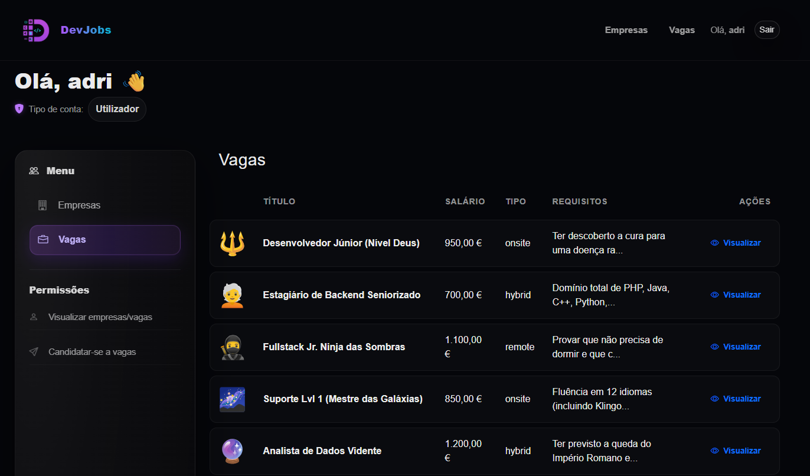

# 🌌 DevJobs — Talent & Job Management Platform

DevJobs é uma plataforma de gestão de talentos desenhada com uma estética **High-End Dark Mode**.  
O foco do projeto é a experiência do **administrador**, permitindo gerir empresas parceiras e publicar vagas com **requisitos claros** e **work type** (Remote / Hybrid / On-site).

---

## 🧠 Funcionalidades Core

| Recurso | Descrição |
|---|---|
| 🏢 **Company Hub** | Registro e gestão de empresas com upload de logo.  |
| ⚡ **Job Factory** | Criação de vagas com **enum** de regime: `remote`, `hybrid`, `onsite`. |
| 💎 **UI Premium** | Interface “Dark” com tons de **Roxo Neon** e **Ciano**. |
| 📊 **Engine CRUD** | Gestão completa via **Eloquent ORM** e **Query Builder**. |
| 📁 **Storage System** | Integração com filesystem para media público (`storage:link`). |
| 🔐 **Acesso por Perfil** | Rotas protegidas + permissões (Admin / Utilizador). |

---

## 🛠️ Stack Tecnológica

### Backend Core
- **Laravel 11**
- **PHP 8.2+**
- **MySQL** 

### Frontend & UI
- **Blade**
- **Custom Modern CSS**
- **Bootstrap (Grid + Modals)** — sem depender do tema visual do Bootstrap
- **Bootstrap Icons** 
---

## 🎥 Visualização

  

  

  

  

---

## 🚀 Como rodar o projeto

- **Clone o repositório:** git clone https://github.com/thaisliira/DevJobs_Website.git
- **Instale as dependências:** composer install
- **Configure** o .env com a sua base de dados MySQL.
- **Gere a chave da aplicação:** php artisan key:generate
- **Execute as migrations:** php artisan migrate
- **Crie o link para imagens:** php artisan storage:link

---

## 🚀 Acesso

- **Admin:** admin@gmail.com | senha: 123456789

- **User:** user@gmail.com | senha:987654321

---

## ⚠️ Observação

Projeto em processo de melhoria contínua com adição de novas funcionalidades;

---

## ✍️ Autor

Thaís Lira
