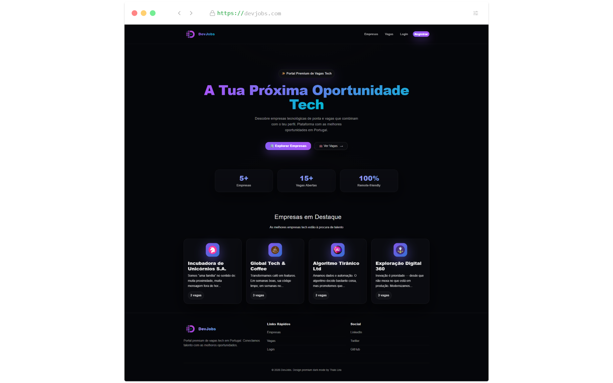
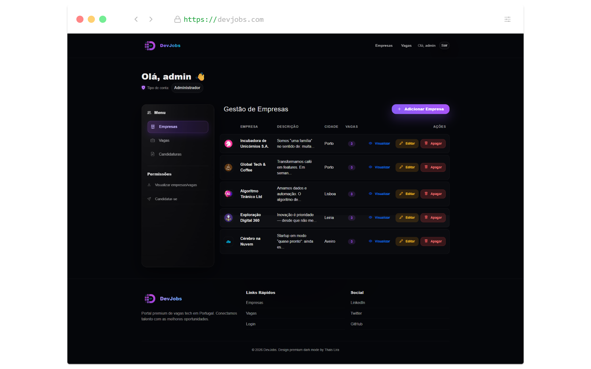
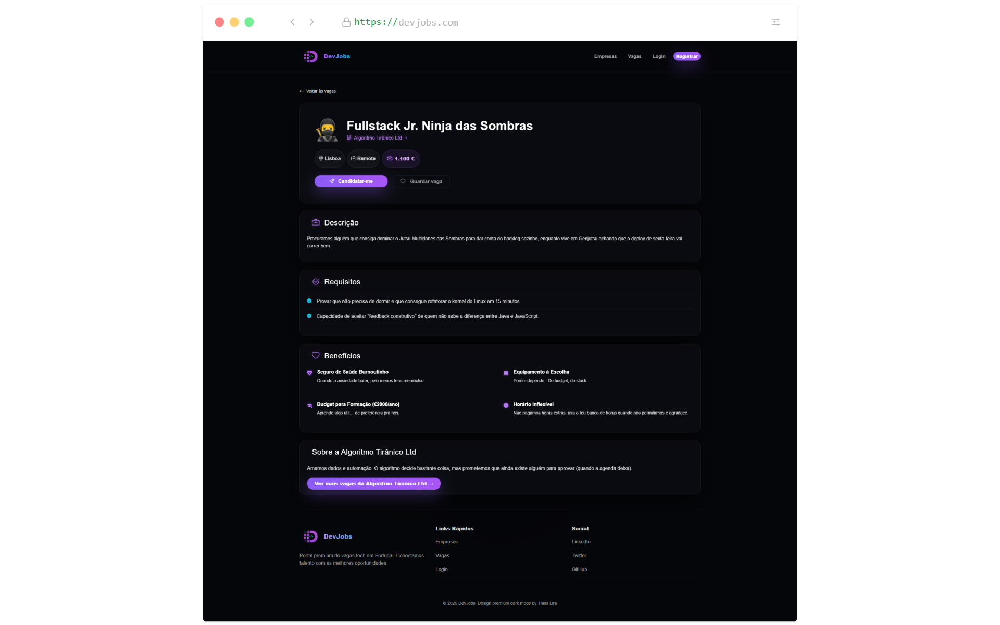

<div align="center">

# 🌌 DevJobs — Talent & Job Management Platform

**A premium recruitment platform focused on tech talent and company management.**

Built with a modern **High-End Dark UI**, DevJobs allows administrators to manage partner companies and publish job opportunities with structured requirements and work models.

[](https://laravel.com/)
[](https://www.php.net/)
[](https://www.mysql.com/)
[](https://getbootstrap.com/)

</div>

---

## 📜 Table of Contents

- [Features](#features)
- [Tech Stack](#tech-stack)
- [Screenshots](#screenshots)
- [Project Setup](#project-setup)
- [Access](#access)
- [Notes](#notes)
- [Author](#author)

---

<a id="features"></a>

## ✨ Features

| Feature | Description |
|---|---|
| 🏢 **Company Hub** | Register and manage partner companies with logo upload support. |
| ⚡ **Job Factory** | Create job listings with structured work types: `remote`, `hybrid`, `onsite`. |
| 💎 **Premium UI** | Modern dark-mode interface with neon purple and cyan accents. |
| 📊 **CRUD Engine** | Full CRUD management powered by Eloquent ORM and Query Builder. |
| 📁 **Storage System** | Public media handling through Laravel filesystem integration (`storage:link`). |
| 🔐 **Role-Based Access** | Protected routes and permission system (Admin / User). |

---

<a id="tech-stack"></a>

## 🛠️ Tech Stack

### Backend
- **Laravel 11**
- **PHP 8.2+**
- **MySQL**

### Frontend & UI
- **Blade**
- **Custom Modern CSS**
- **Bootstrap** (Grid + Modals)
- **Bootstrap Icons**

---

<a id="screenshots"></a>

## 🎥 Screenshots

<p align="center">
  
</p>

<p align="center">
  
</p>

<p align="center">
  
</p>

---

<a id="project-setup"></a>

## 🚀 Project Setup

### 1. Clone the repository

```bash
git clone https://github.com/thaisliira/DevJobs_Website.git
cd DevJobs_Website
```

### 2. Install dependencies

```bash
composer install
```

### 3. Configure environment

Create and configure your `.env` file with your MySQL database credentials.

### 4. Generate application key

```bash
php artisan key:generate
```

### 5. Run migrations

```bash
php artisan migrate
```

### 6. Create storage symlink

```bash
php artisan storage:link
```

### 7. Start local server

```bash
php artisan serve
```

Application available at:

```text
http://127.0.0.1:8000
```

---

<a id="access"></a>

## 🔒 Access

| Role | Email | Password |
|---|---|---|
| **Admin** | `admin@gmail.com` | `123456789` |
| **User** | `user@gmail.com` | `987654321` |

---

<a id="notes"></a>

## 📝 Notes

- This project is under continuous improvement with new features and UI refinements.
- Bootstrap is used only for layout utilities and modal structure — the visual identity is fully customized.
- Uploaded company logos are stored using Laravel's filesystem abstraction.

---

## <a id="author"></a>👩‍💻 Author

<table>
  <tr>
    <td align="center">
      <a href="https://github.com/thaisliira">
        <br>
        <sub><b>Thais Lira</b></sub>
      </a>
    </td>
  </tr>
</table>
